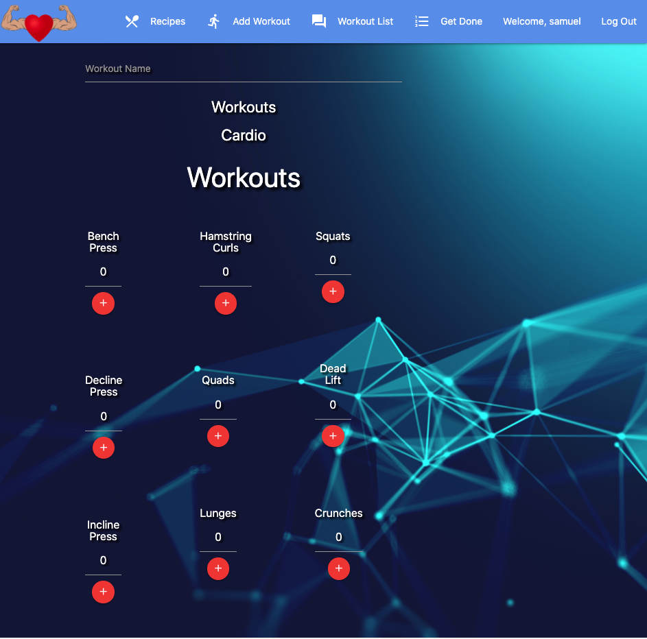
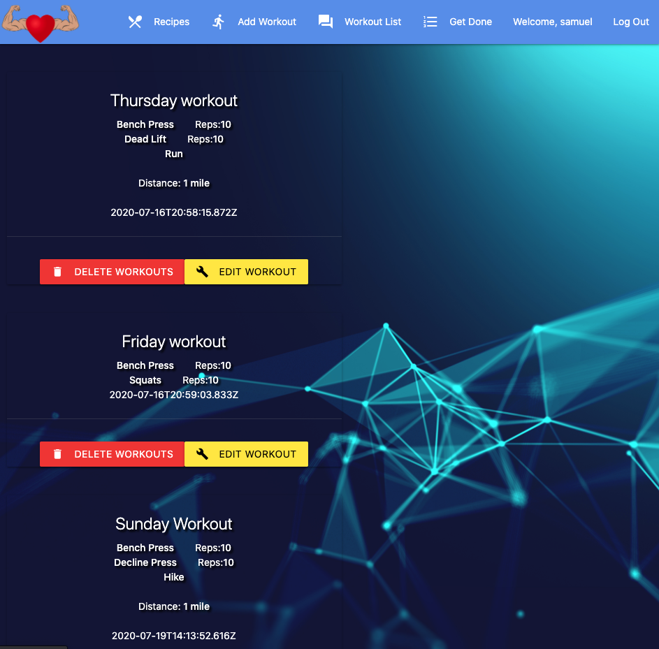
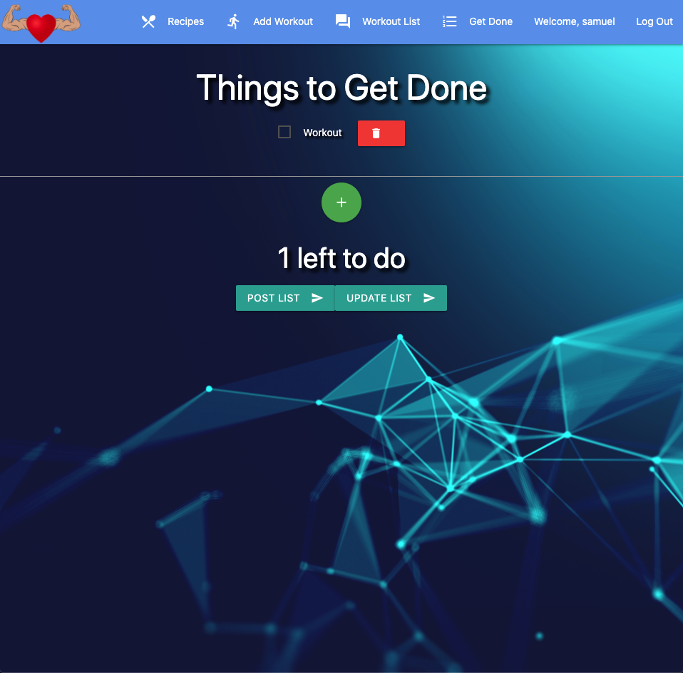

Date: 7/22/20
By: Samuel Trahan

[LinkedIn](https://www.linkedin.com/in/samueltrahan/)

---
# Description

Heart is a health and lifestyle application used to keep track of workouts and things that you may need to get done.  With a added recipe feature to help users look up healthy meals.

---
# Technology Used

MongoDB
Express
React
Node.js
HTML
CSS

---
# Getting Started

Login to Heart to get started.  Add a workout playlist so that you can keep track of all workouts and progress you have made. Add thing to get to your Get Done list so that you stay on top of your goals and tasks for the day. And lastly, browse the recipe section so that you can find healthy and delicious meals.

A Trello board that was used during the development of this app can be found [here](https://trello.com/b/QTAU6jJh/heart)

This project was deployed using Heroku and can be found [here](https://createheart.herokuapp.com/)

---
# ScreenShots

---
# Future Improvements 

- [ ] Save Recipes 
- [ ] Make list of workouts more in depth
- [ ] Have times added to things to get done
- [ ] Implement more apis to help the app have more information and not all info coming from the user
  
---
# Credits

 Edamam API
